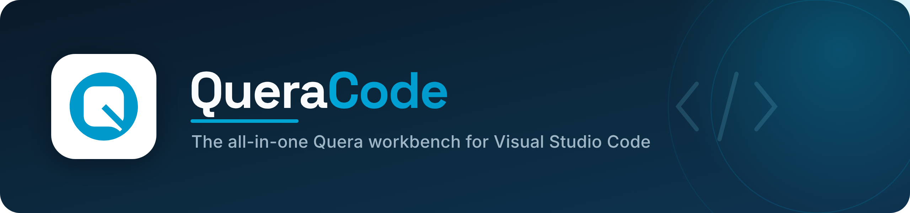
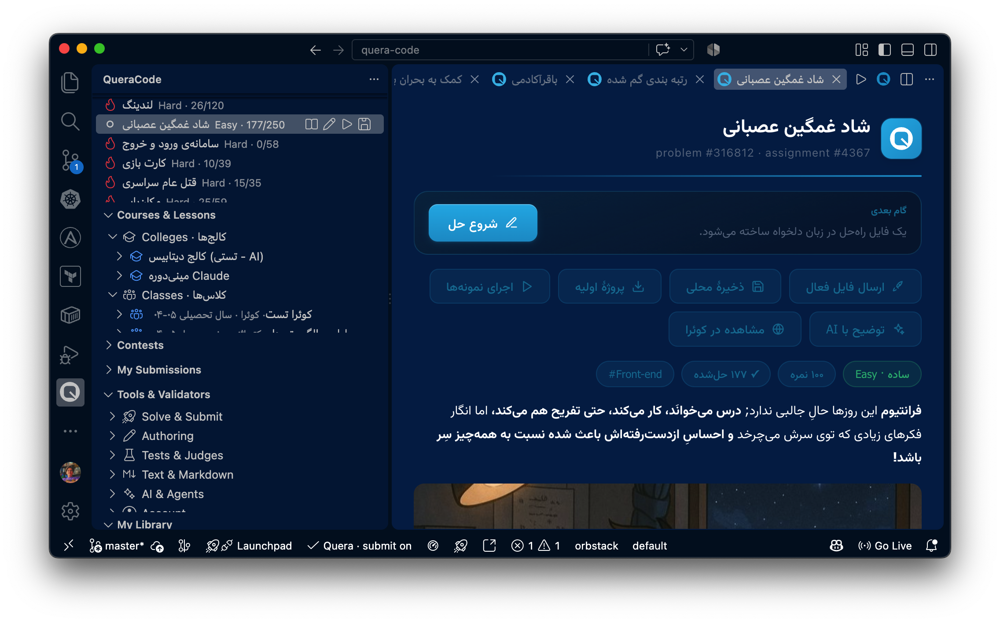
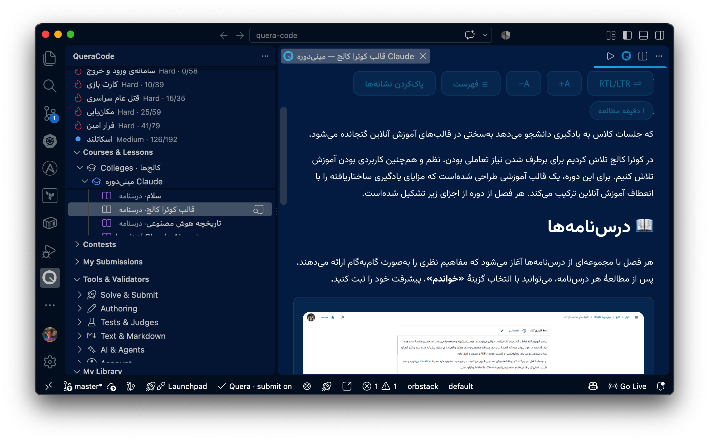
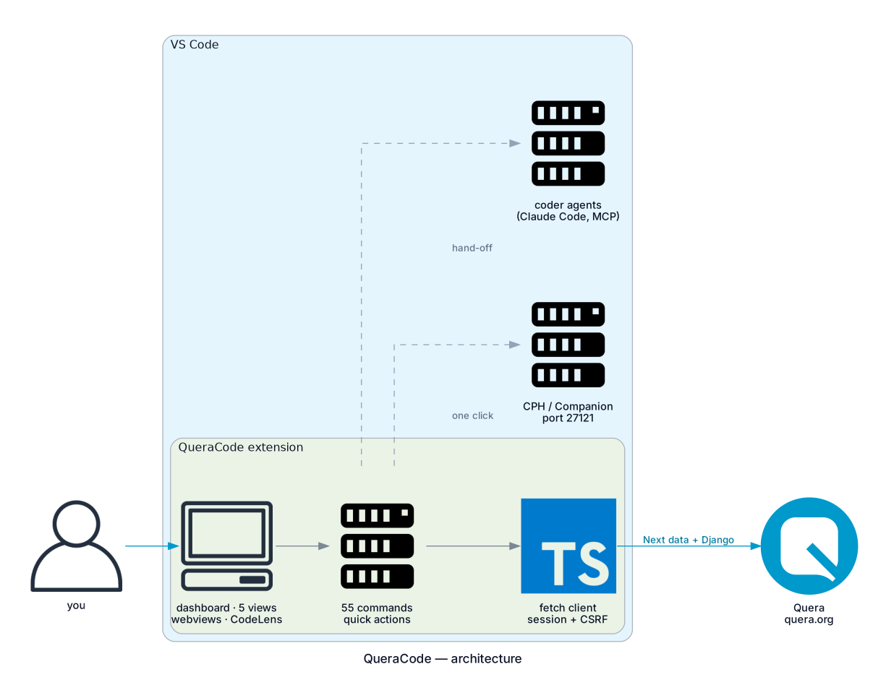
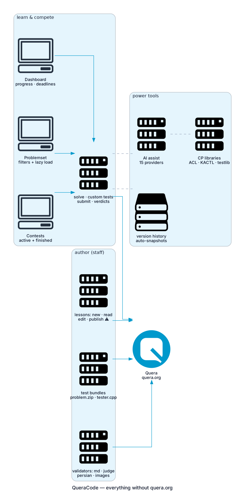
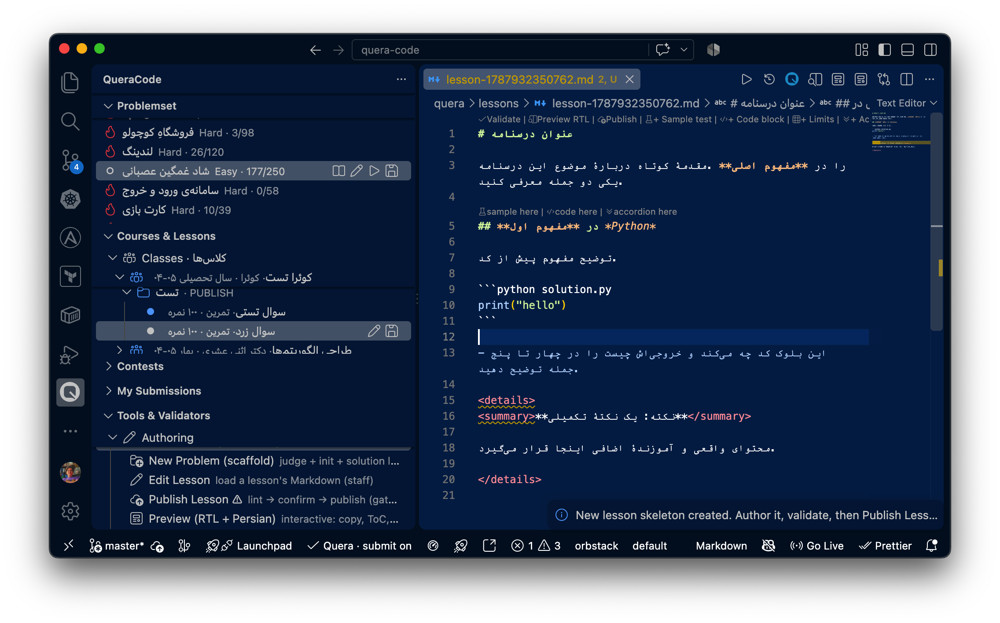
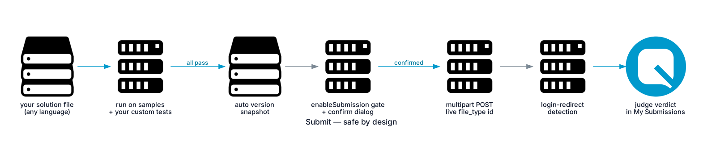
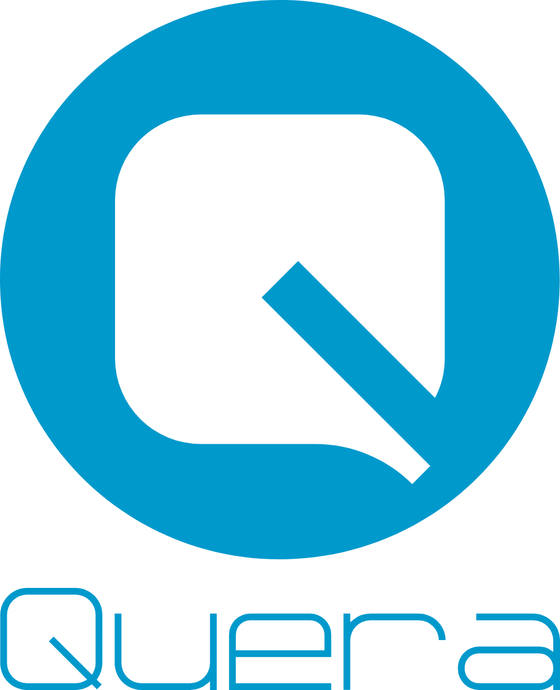

<div align="center">



<br/>


<h1>QueraCode</h1>

**The all-in-one [Quera](https://quera.org) workbench for Visual Studio Code — dashboard, problemset, contests, classes & colleges, solve/submit with verdicts, author lessons/problems/judges with one-click actions, versioning, AI assist, and coder-agent hand-off. Everything Quera, without opening quera.org.**

[](.github/workflows/ci.yml)
[](test/)
[](https://code.visualstudio.com/)
[](https://www.typescriptlang.org/)
[](#commands)
[](#rtl--persian)
[](#ai-assistance-optional)
[](#coder-agent-integration)
[](LICENSE)

</div>

---

QueraCode brings the whole Quera experience **inside your editor**. It serves
**everyone** — a learner who wants to browse, read LLM/programming lessons, solve
and submit; and Quera **staff** who develop courses, lessons, problems, and
project judges. Everything you can do on Quera, from VS Code.

<div align="center">



<sub>QueraCode in VS Code: the Problemset sidebar (with live counts and difficulty) and the problem panel. The panel is rendered by the extension's own webview code; RTL + Persian (Vazirmatn) is fully supported for Persian content.</sub>

</div>




## Architecture

QueraCode talks to Quera the way a browser does (session cookie + CSRF), reading
the Next.js data endpoint with an HTML `__NEXT_DATA__` fallback and the legacy
Django pages — fully self-contained, no other tool required. Optionally, one
command registers the sibling **QueraMCP** server so coder agents can drive
Quera too (it then appears under "MCP Servers" in the Extensions view; that
entry is the server registration, not this extension).



## Feature map



### For learners

- **Quera Dashboard** as the landing page (`Ctrl/Cmd+Alt+D`): profile, college
  progress bars, LMS classes, upcoming **deadlines**, contests, practice
  suggestions — every card is a one-click action. A **pulsing Quera logo**
  shows while anything loads.
- **Problemset browser** with **every Quera filter** — difficulty, tags, type,
  category, solve status, order, free-text search — and **lazy loading**
  ("Load more" accumulates pages).
- **Contests view**: active + finished contests from quera.org/contest — open,
  read, and **solve contest problems** without the website.
- **Classes (کلاس‌ها) and Colleges (کالج)** as separate tree sections — exactly
  how Quera splits them.
- **Problem viewer** webview that renders the statement as Markdown with **RTL +
  Persian (Vazirmatn)** typography and Quera branding.
- **Solve**: pick a language, get a solution scaffold, **download the initial
  project**, **run against the samples** in a Docker/local sandbox, then
  **submit** (gated) and **watch the judge verdict** — all without leaving VS Code.
- **My Submissions** tree with verdicts and per-test results.
- **Quick Submit**: a Quera button on *every* editor tab (`Ctrl/Cmd+Alt+U`) —
  paste any problem URL and the active file is submitted with the live
  file-type id (auto **version snapshot** first).
- **Custom tests**: `Quera: Add Custom Test` (`Ctrl/Cmd+Alt+T`) stores your own
  input/output pairs; **Run on Samples** runs statement samples *and* yours.
- **Version history** (`Ctrl/Cmd+Alt+H`): every submit/publish auto-snapshots;
  diff, restore, or open any prior state.
- **CP power tools**: one-click **Send to CPH** (Competitive Companion
  protocol) and **Setup CP Library** (AtCoder Library, KACTL, testlib,
  cp-algorithms cloned into your workspace).




### For staff / authors

- **New lesson / problem** skeletons in Quera's Markdown dialect.
- **Validate** everything: the Markdown dialect linter, Persian normalizer,
  `tester_config.json` judge validator, test-name checker, and DevOps image
  (qregistry) validator — results shown in a themed panel.
- **Insert** Quera macros (`%problem.X%`, `%video.X%`) and CP templates
  (DSU, Dijkstra, sieve, Fenwick).
- **Live RTL + Persian preview** — modern and interactive: copy buttons on
  code blocks, a jump table-of-contents, RTL/LTR and font-size toggles.
- **One-click authoring overlays (CodeLens)** on every Markdown file: validate,
  preview, publish, insert sample test / code block / limits / accordion at any
  section.
- **Test bundles**: generate seeded inputs, build `problem.zip`
  (`in/` + `out/` + `tester.cpp`), validate the structure — the exact
  Sharif-Judge layout Quera's judge expects.



## Install

**Easy install (recommended)** — grab `queracode-0.1.0.vsix` and either:

- drag it onto the Extensions view, **or**
- `Ctrl/Cmd+Shift+P` → *"Extensions: Install from VSIX…"*, **or**
- `code --install-extension queracode-0.1.0.vsix`

Build the `.vsix` yourself from source:

```bash
cd queracode
npm install
npm run compile      # type-check + emit
npm run unit         # 67 unit tests
npm run package      # -> queracode.vsix
# or press F5 in VS Code for an Extension Development Host
```

Full walkthrough (install, sign-in, first solve, staff authoring, AI setup):
[`docs/INSTALL.md`](docs/INSTALL.md).

## Sign in

Two ways, chosen by `queracode.authMethod`:

- **Session id** — run **“Quera: Sign In”** and paste your `session_id` cookie
  (stored in VS Code SecretStorage, never in settings).
- **Username / password** — set `queracode.username`, then sign in and enter the
  password (also stored in SecretStorage).

## Commands

| Command | What it does |
| --- | --- |
| `Quera: Sign In` / `Sign Out` / `Who Am I` | session management |
| `Quera: Set Problemset Filters` / `Search Problems` | filter/search the problemset |
| `Quera: Open Problem` | open the statement in an RTL webview |
| `Quera: Solve Problem` | language picker → solution scaffold in your workspace |
| `Quera: Download Initial Project` | fetch the starter ZIP |
| `Quera: Run Solution on Samples` | run in a sandbox and diff outputs |
| `Quera: Submit Solution` ⚠ | submit the active file to Quera |
| `Quera: View Submission Result` | verdict + per-test breakdown |
| `Quera: Open Course` / `Open Lesson` | course dashboard / chapter problem list |
| `Quera: Read Lesson` | read any lesson/problem page as rendered RTL Markdown |
| `Quera: New Lesson` / `New Problem` | authoring skeletons |
| `Quera: Edit Lesson` | load a lesson's stored Markdown for editing (staff) |
| `Quera: Publish Lesson` ⚠ | lint then publish |
| `Quera: Preview (RTL + Persian)` | rendered Quera-flavor preview |
| `Quera: Validate Markdown / Judge / Test Names / DevOps Image` | validators |
| `Quera: Normalize Persian Text` | fix ZWNJ / Arabic letters in place |
| `Quera: Insert Macro / CP Template` | snippets |
| `Quera: Generate Test Inputs` | random/edge-case judge inputs from a spec |
| `Quera: Build Test Bundle (problem.zip)` | write `in/` + `out/` + `tester.cpp` + zip |
| `Quera: Insert tester.cpp` / `Validate Test Bundle` | special-judge scaffold / structure check |
| `Quera AI: Configure AI Provider` | pick a provider, store the key in SecretStorage |
| `Quera AI: Generate Solution / Explain Problem / Review Submission / Chat` | model-assisted solving |
| `Quera: Open Dashboard` | your Quera home — progress, deadlines, contests |
| `Quera: Open/Solve Contest Problem` | contests without the website |
| `Quera: Quick Submit (by problem URL)` | the Quera button on every editor tab |
| `Quera: Save Problem Locally` | statement + meta + sample tests to disk |
| `Quera: Add Custom Test` | your own input/output for the sample runner |
| `Quera: Snapshot Version / Version History` | local versioning, diff & restore |
| `Quera: Send to CPH` | Competitive Companion hand-off (port 27121) |
| `Quera: Setup CP Library` | clone ACL / KACTL / testlib / cp-algorithms |
| `Quera: Solve with Claude Code` | launch `claude` with a solving brief |
| `Quera: Insert Sample Test / Code Block / Limits / Accordion` | CodeLens one-click authoring |
| `Quera: Register QueraMCP for Coder Agents` | wire up agent access |
| `Quera: Solve with Coder Agent` | hand a solving brief to your agent |

⚠ = gated by `queracode.enableSubmission` / `queracode.enableWrite` (both off by
default; `queracode.readOnly` forces them off).

## Keybindings

| Shortcut | Command |
| --- | --- |
| `Ctrl/Cmd+Alt+Enter` | Submit Solution |
| `Ctrl/Cmd+Alt+R` | Run on Samples |
| `Ctrl/Cmd+Alt+V` | Preview (RTL + Persian) |
| `Ctrl/Cmd+Alt+P` | Search Problems |
| `Ctrl/Cmd+Alt+J` | Validate Judge |

## RTL + Persian

QueraCode is built for Persian content: the problem/lesson webviews render
right-to-left with a configurable **Vazirmatn** font stack, code blocks stay LTR
and monospaced, and Quera's Markdown macros are highlighted. Configure via
`queracode.editorDirection`, `queracode.persianFont`, `queracode.latinFont`,
`queracode.monoFont`.

## Sandboxing

“Run on samples” executes your solution **isolated in Docker** by default
(`--network=none`, memory/CPU caps), or locally, or emits the command for you to
run — set `queracode.sandbox` to `docker` / `local` / `none`. All languages and
frameworks Quera supports are covered.

## AI assistance (optional)

QueraCode can call an AI model directly — pick a provider with
**"Quera AI: Configure AI Provider"**: **OpenRouter**, OpenAI, Anthropic, Groq,
Together, DeepSeek, Mistral, Fireworks, xAI, Perplexity, Gemini, AvalAI
(Iran-reachable), local **Ollama** / **LM Studio**, or any OpenAI-compatible
endpoint. The API key is stored in **SecretStorage** (never in settings) and
local providers need no key at all.

- **Generate Solution** — drafts code for a problem into your workspace (never submits).
- **Explain Problem** — a learner-friendly brief, no spoiler code.
- **Review Submission** — feeds the verdict + judge log + your code to the model.
- **Chat** — free-form prompt, rendered in a themed panel.

Settings: `queracode.ai.provider`, `queracode.ai.model`, `queracode.ai.baseUrl`.

## Test generators (judge bundles)

Author the exact `problem.zip` Quera's judge (Sharif-Judge) expects:
**Generate Test Inputs** (arrays, matrices, strings, pairs, graphs — seeded and
reproducible, plus edge cases), **Build Test Bundle** (writes `in/inputN.txt`,
`out/outputN.txt`, optional `tester.cpp`, and a store-only `problem.zip`),
**Insert tester.cpp** (the argv contract: input / jury output / user output;
exit 0 = accept, 1 = reject), and **Validate Test Bundle** (naming, pairing,
contiguous numbering) — all offline.

## Claude Code & coder agents

**Quera: Solve with Claude Code** saves the statement into your workspace and
launches `claude` in the integrated terminal with a ready solving brief.
QueraCode also stays fully **independent** of QueraMCP — its own fetch client
does all Quera I/O — while optionally registering QueraMCP for MCP-capable
agents:

## Coder-agent integration

QueraCode is agent-friendly. It writes a `.vscode/mcp.json` that registers
**QueraMCP** so MCP-capable agents (GitHub Copilot agent mode, Claude, …) can
browse/solve/submit Quera, and it exposes an **extension API** other extensions
can consume:

```ts
const quera = vscode.extensions.getExtension("dwin-gharibi.queracode")?.exports;
const page = await quera.listProblems({ difficulty: ["HARD"], tag: ["78"] }, 1);
```

## Settings

All under the `queracode.*` namespace. **Credentials live only in VS Code
SecretStorage — never in `settings.json`.**

| Setting | Default | Description |
| --- | --- | --- |
| `baseUrl` | `https://quera.org/` | Quera base URL. |
| `authMethod` | `sessionId` | `sessionId` or `usernamePassword`. |
| `username` | — | Quera username/email (password goes to SecretStorage). |
| `defaultLanguage` | `python` | Default language for new solutions. |
| `locale` | `fa` | Content locale (`fa` / `en` / `ar`). |
| `editorDirection` | `auto` | `auto` / `rtl` / `ltr` for the preview & panels. |
| `persianFont` / `latinFont` / `monoFont` | Vazirmatn / Inter / JetBrains Mono | Webview font stacks. |
| `enableSubmission` | `false` | Allow submitting solutions (gated). |
| `enableWrite` | `false` | Allow publishing/editing content (gated). |
| `readOnly` | `false` | Master switch: forces both gates off. |
| `sandbox` | `docker` | `docker` / `local` / `none` for running samples. |
| `problemsetPageSize` | `25` | Problems per page in the sidebar. |
| `solutionsDir` | `quera` | Workspace subfolder for solutions & downloads. |
| `autoRegisterMcp` | `false` | Opt-in: write `.vscode/mcp.json` registering QueraMCP for coder agents (shows under "MCP Servers" in the Extensions view). |
| `openDashboardOnStartup` | `false` | Open the Quera Dashboard when VS Code starts. Off by default — the dashboard is one keystroke away (`Ctrl+Alt+D`), and opening a panel on every launch was unwelcome. |
| `customCss` | — | Custom CSS injected into every webview — bring your own fonts (`@font-face`), colors, sizes. |
| `fontSize` | `14.5` | Base font size (px) for panels and previews. |
| `accentColor` | — | Override the Quera cyan (`#RRGGBB`). |
| `ai.provider` / `ai.model` / `ai.baseUrl` | `openrouter` | AI provider (key lives in SecretStorage). |
| `repo.autoPull` | `false` | Fast-forward the course repo on a timer. Skipped while the tree is dirty or mid-merge. |
| `repo.autoPullIntervalMinutes` | `15` | How often to fast-forward. |
| `repo.autoPush` | `false` | Commit and push saved changes. **A push runs the repo's workflow and publishes to the live college.** Requires `enableWrite`. |
| `repo.autoPushDelaySeconds` | `45` | Quiet period before auto-push commits. |
| `repo.branch` | — | Branch auto-commits land on; created from HEAD if absent. Empty = whatever is checked out. |
| `repo.commitMessage` | `درسنامه: ${files} (QueraCode)` | Template — `${files}`, `${count}`, `${date}`. |
| `sync.autoPublishOnSave` | `false` | Publish a **bound** file straight to Quera on save. Students see it immediately; requires `enableWrite`. |
| `sync.publishDelaySeconds` | `3` | Quiet period before auto-publish fires. |
| `sync.confirmBeforePublish` | `true` | Ask before a manual publish. |

## Course authoring and sync

A Quera college can be authored as a Git repository — chapters are folders,
each درسنامه is a directory holding `statement.md` (its first `#` heading is the
title Quera matches on), and a GitHub Actions workflow publishes what changed on
push. QueraCode drives that shape, and offers a direct route that skips git.


**Course Repository view** — the linked college as curriculum rather than files:
chapters in config order, and inside each the درسنامه the sync will actually
publish. Create, rename, delete and reveal from the row. Folders with no
statement stay hidden, because the sync ignores them too.

**Two routes to Quera**

| | Route | What happens |
| --- | --- | --- |
| Git | `repo.autoPush` | Commit → push to your branch → the repo's workflow publishes. |
| Direct | `sync.autoPublishOnSave` | Bind a file, then publish straight to Quera from the editor. |

**Getting started**

```bash
# link an existing folder to a college — writes .quera-sync/config.json
#   Quera: Link a College to This Repository
# or pull an existing college down into it
#   Quera: Import a College into This Repository
```

Add `QUERA_SESSION_ID` as a repository secret so the workflow can publish.

**Safety.** Both routes are off by default and gated behind
`queracode.enableWrite`. Auto-pull is `--ff-only` and skips a dirty or
mid-merge tree, so it can never overwrite local work. A direct pull shows a
real diff before replacing a non-empty file. Deleting a درسنامه locally does
not delete it on Quera — the sync renames it using
`deleted_lesson.title_template`.

## Troubleshooting

| Symptom | Cause & fix |
| --- | --- |
| Sidebar shows "Sign in to Quera…" | Not signed in — run **Quera: Sign In**. |
| "Error: Authentication failed (401/403)" | `session_id` missing/expired or lacks permission — sign in again. |
| Problems don't load / connection reset | Quera is geo-restricted + WAF-protected; reads can fail outside Iran. |
| "Submitting is disabled" | Enable `queracode.enableSubmission` (and turn off `readOnly`). |
| "Run on samples" prints a command instead of running | `queracode.sandbox` is `none`, or Docker isn't installed — set it to `docker`/`local`. |

## Testing

```bash
npm run lint            # tsc --noEmit (strict)
npm run unit            # 160 unit tests — validators, testkit, zip writer, verdicts,
                        # Persian formatting, command-argument coercion, bindings
npm run check:manifest  # contributions point at things that exist; icon-only
                        # slots have icons; nothing stray would ship
npm run test:repo       # 43 checks: course-repo sync against a real clone
npm run verify          # all of the above

# these need a Quera session
QUERA_SESSION_ID=… npm run test:live       # 38 checks against live Quera
QUERA_SESSION_ID=… npm run test:extension  # 36 checks driving activate() + trees
QUERA_SESSION_ID=… npm run test:commands   # every registered command, executed
QUERA_SESSION_ID=… npm run verify:live     # everything

npm run package         # build queracode.vsix (needs Node 20+)
```

## Related


- **[QueraMCP](../quera-mcp/)** — the sibling MCP server (203 tools). Independent
  project; QueraCode registers it for agents and mirrors its Quera knowledge.

## License

[MIT](LICENSE). Unofficial, community-built; the Quera name and logo belong to
their owner.


<div align="center">

<br/>
